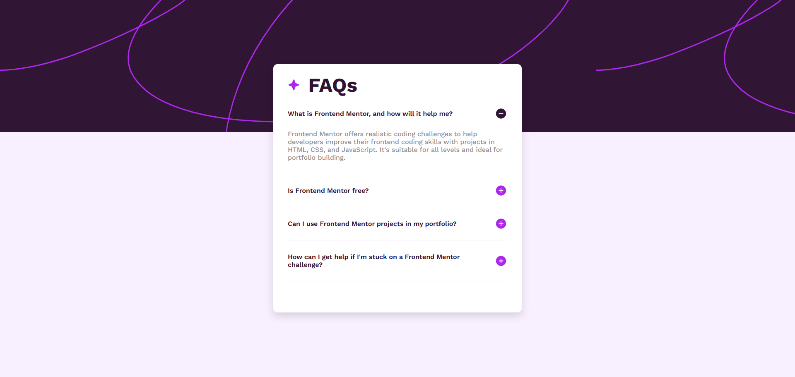

# Frontend Mentor - FAQ Accordion Solution

This is a solution to the [FAQ accordion challenge on Frontend Mentor](https://www.frontendmentor.io/challenges/faq-accordion-wyfFdeBwBz). Frontend Mentor challenges help you improve your coding skills by building realistic projects.

## Table of Contents

* [Overview](#overview)

  * [The Challenge](#the-challenge)
  * [Screenshot](#screenshot)
  * [Links](#links)
* [My Process](#my-process)

  * [Built With](#built-with)
  * [What I Learned](#what-i-learned)
  * [Continued Development](#continued-development)
* [Author](#author)

## Overview

### The Challenge

Users should be able to:

* Hide/Show the answer to a question when the question is clicked
* Navigate the questions and hide/show answers using keyboard navigation alone
* View the optimal layout for the interface depending on their device's screen size
* See hover and focus states for all interactive elements on the page

### Screenshot



### Links

* Solution URL: [https://www.frontendmentor.io/solutions/faq-accordion-html-css-and-js-uePDD2nBVN](#)
* Live Site URL: [https://dark1010101010.github.io/FAQ-accordion/](#)

## My Process

### Built With

* HTML5
* CSS3
* JavaScript (vanilla)

### What I Learned

During this project, I practiced working with JavaScript to dynamically combine HTML elements, which helped me learn how to render multiple elements based on data. I also learned how to create a dropdown/accordion effect without using the actual `<select>` or `<details>` HTML elements.

```js
// Example: toggling answer visibility
document.querySelectorAll('.js-question-container').forEach((question) => {
  question.addEventListener('click', () => {
    const qId = question.dataset.qId;
    document.querySelector(`.js-answer-${qId}`).classList.toggle('display-answer');
  });
});
```

### Continued Development

In future projects, I want to focus on:

* Improving accessibility (keyboard navigation, ARIA attributes)
* More advanced DOM manipulation patterns
* Optimizing performance for dynamic content rendering

## Author

* Name: Rajesh Medudula
* Frontend Mentor: [@dark1010101010](https://www.frontendmentor.io/profile/dark1010101010)

